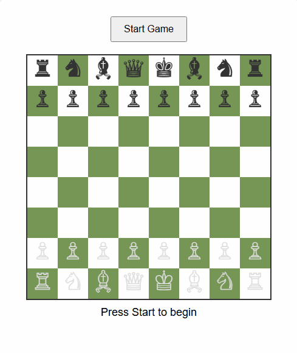

# Simple Chess

One of the personal projects I've always wanted to create is a Chess game. To be honest, the complexity always felt too advance for me, and with "Vibe coding" being a trend in 2025, I thought I'd write a **single prompt** to see what it can come up with and how it would look. 

I didn't write any other prompts or attempt to modify the code.



At the very least, I'll use this to understand how it can be done and make amendments/refactors in a separate project when I decide to build my own. 

I've used [Grok](https://grok.com/) with the following prompt:

```
I would like to create a working chess game in JS, this game will have both the UI and logic all implemented with a start button, once clicked the game will begin and the "White" player will start first, after they make their move, the black player will move next, then after their move is made it will switch back to white. The game will stop when someone checkmates the other

```
Here was Grok's response then proceed to generate a single html file:

```
Below is a complete implementation of a chess game using JavaScript and HTML, including both the UI and game logic. The game features a start button, alternates between White and Black players, and stops when a checkmate occurs. The board is rendered using a canvas, and the game logic handles legal chess moves, check, and checkmate detection.
```


The `index.html` was what was generated. I didn't amend or change anything but it seems to be a working game. 

**NOTE: I haven't spent any time trying to verify the rules and whether there are any bugs with the game**
